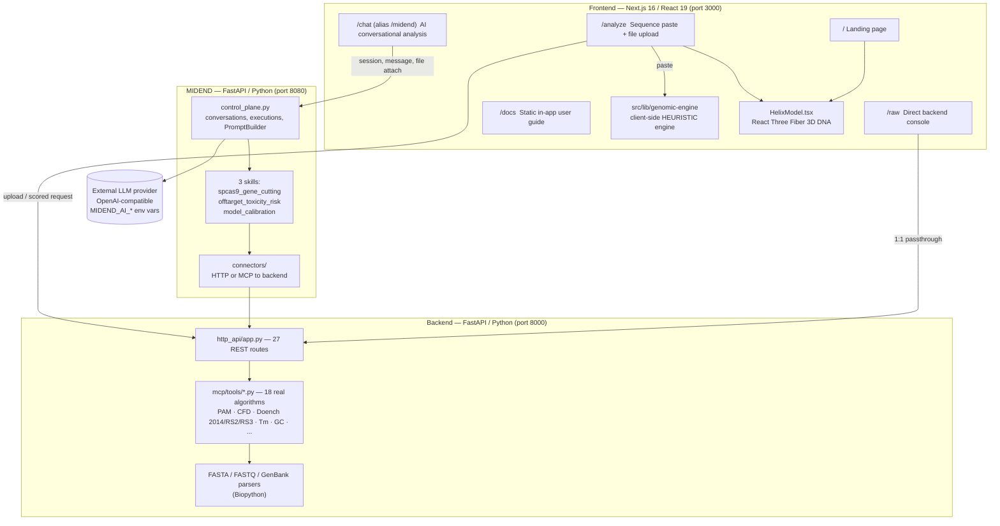

<div align="center">


# VEYRA — Genomic Intelligence

**An interpretable CRISPR/Cas9 guide RNA design and off-target risk assessment platform.**
Every score traces to a real, deterministic computation. An AI layer explains the results — it never invents them.

[](https://nextjs.org/)
[](https://react.dev/)
[](https://www.typescriptlang.org/)
[](https://tailwindcss.com/)
[](https://threejs.org/)
[](https://docs.pmnd.rs/react-three-fiber)
[](https://fastapi.tiangolo.com/)
[](https://www.python.org/)
[](https://biopython.org/)
[](https://www.uvicorn.org/)
[](https://modelcontextprotocol.io/)
[](#environment-variables)
[](https://eslint.org/)
[](LICENSE)
[](#known-limitations)
[](#scientific-integrity)

</div>

---

## Table of contents

- [Overview](#overview)
- [The problem](#the-problem)
  - [Research validating the problem](#research-validating-the-problem)
- [The solution](#the-solution)
- [Tech stack & tags](#tech-stack--tags)
- [Architecture](#architecture)
- [Deterministic engine: real vs. heuristic](#deterministic-engine-real-vs-heuristic)
- [Getting started](#getting-started)
- [Using the app](#using-the-app)
- [API surface](#api-surface)
- [Environment variables](#environment-variables)
- [Testing](#testing)
- [Project structure](#project-structure)
- [App icon](#app-icon)
- [Known limitations](#known-limitations)
- [Roadmap](#roadmap)
- [Scientific integrity](#scientific-integrity)
- [References](#references)
- [License](#license)

---

## Overview

VEYRA scores CRISPR guide RNA candidates against a target DNA sequence — PAM discovery, on-target efficiency, off-target risk — and presents the results through an interactive 3D locus view and a conversational AI assistant.

It is built as **three independently deployable services**, with no shared database:

1. **Frontend** (Next.js 16 / React 19) — the UI, a client side heuristic scoring engine for instant feedback, a 3D DNA visualization, and three distinct ways to reach the engine.
2. **MIDEND** (FastAPI / Python) — an AI orchestration layer. It never computes biology itself; it calls the backend's real tools and asks a configured LLM to interpret the results.
3. **Backend** (FastAPI / Python) — the deterministic scientific core: PAM scanning, GC/Tm/homopolymer/secondary structure features, CFD off-target scoring against real CRISPOR resource data, and on-target efficiency prediction across multiple models with a transparent fallback chain.

> **Research prototype. Not for clinical, diagnostic, or regulatory use.**

## The problem

Off-target CRISPR risk is real and documented, not hypothetical — published trials have detected unintended genomic events in edited patient cells (see [References](#references)). Yet the tools researchers commonly reach for hand back a single opaque probability from a short sequence window, with no way to see what algorithm produced it or why. When something needs scrutiny — a detected translocation, an unexpected off-target hit — there's often no trail back to the underlying computation.

### Research validating the problem

CRISPR precision is improving — but unintended genomic changes remain measurable, and they go well beyond simple mismatch-based off-targets:

| | | |
|---|---|---|
| **9.9%** | **6%** | **47** |
| Chromosome 7 truncation observed in primary human T cells edited with CRISPR-Cas9 (chromosome 14 loss in up to 9% of cells in the same study). | Structural variants ≥50 bp among editing outcomes in a zebrafish study of 1,100+ founder larvae, long-read sequenced; some changes were inherited across generations. | Bona fide off-target loci identified by TOPO-seq across three therapeutic gRNAs in hematopoietic stem cells; 6 were specifically induced by DNA topology, and most of those had 6 mismatches — sites mismatch-focused approaches can miss. |
| [*Nature Biotechnology*, 2022](https://www.nature.com/articles/s41587-022-01377-0) | [*Nature Communications*, 2022](https://www.nature.com/articles/s41467-022-28244-5) | [*Nature Chemical Biology*, 2025](https://www.nature.com/articles/s41589-025-01867-7) |

**The problem isn't only "off-target = mismatch."** Recent research shows unintended outcomes can include large deletions, chromosome loss, translocations, and other structural variants — meaning genomic safety assessment needs to look beyond simple sequence similarity ([*Nature Communications*, 2025](https://www.nature.com/articles/s41467-025-62606-z)). Not all off-target events carry the same clinical risk, and interpreting which ones matter is itself an open problem ([*Nature Genetics*, 2025](https://www.nature.com/articles/s41588-025-02428-3)).

## The solution

VEYRA scores the *whole* provided locus, not a 20 bp window, and keeps every number traceable:

- **Deterministic core** — PAM search, GC content, melting temperature, homopolymer runs, secondary structure (ViennaRNA), CFD off-target scoring (real CRISPOR data), and on-target prediction across multiple models (Doench 2014 / Rule Set 2 / Rule Set 3) with a transparent, reported fallback chain. Same input → same output, every run.
- **AI reasoning, not AI computation** — the AI layer explains and contextualizes deterministic results; it never fabricates a score. Every claim the AI generates in the UI is either traced to a specific tool call or clearly labeled as interpretation.
- **Interactive visualization** — a real time 3D DNA structure and a live tool call activity feed, so the AI's reasoning is auditable rather than a black box.

---

## Tech stack & tags

| Layer | Technology | Tag | Role |
|---|---|---|---|
| Frontend framework | **Next.js** `16.3.1` (App Router) | `#nextjs` `#react-server-components` | Routing, SSR/CSR, API routes |
| UI library | **React** `19.2.8` | `#react` `#react19` | Component model |
| Language | **TypeScript** `^5` (strict mode) | `#typescript` | Type safety across the whole frontend |
| Styling | **Tailwind CSS** `v4` (CSS first config via `@theme`, no `tailwind.config.js`) | `#tailwindcss` `#design-tokens` | Utility CSS and the glassmorphic design system in `globals.css` |
| 3D rendering | **three.js** `^0.185` with **React Three Fiber** `^9.7` and **drei** `^10.7` | `#threejs` `#webgl` `#r3f` | The DNA double helix visualization (`HelixModel.tsx`) |
| Icons | **lucide-react** `^1.31` | `#lucide` | Nav/UI iconography |
| Linting | **ESLint** `9` + `eslint-config-next` | `#eslint` | Lint rules that understand `next.config` |
| AI orchestration | **FastAPI** (Python, MIDEND service) | `#fastapi` `#python` `#agentic-orchestration` | Conversation state, prompt building, tool call dispatch |
| Deterministic engine | **FastAPI** (Python, Backend service) | `#fastapi` `#python` | 27 REST endpoints over 18 real algorithm tools |
| Bioinformatics parsing | **Biopython** `>=1.83,<1.84` | `#biopython` | FASTA / FASTQ / GenBank parsing |
| Numerics | **NumPy** `>=1.26` | `#numpy` | Feature computation |
| ASGI server | **Uvicorn** `>=0.30,<1` | `#uvicorn` `#asgi` | Serves both Python services |
| HTTP client | **httpx** `>=0.28,<1` | `#httpx` | MIDEND to Backend connector |
| Off-target search | **BWA** + **Cas-OFFinder** | `#bwa` `#cas-offinder` | Genome scale mismatch search (when a reference genome is registered) |
| Off-target scoring | **CRISPOR CFD resources** (Doench et al. 2016) | `#crispor` `#cfd-scoring` | Real, published Cutting Frequency Determination scoring |
| On-target models | **Rule Set 3** (LightGBM via `rs3`, registry status `verified`, priority 1), **Doench 2014** (pure Python, `verified`, guaranteed fallback), **Rule Set 2** (Azimuth, registry status `incompatible`, needs a Python 2.7/scikit-learn 0.17.1 runtime) | `#doench2014` `#rule-set-2` `#rule-set-3` `#lightgbm` | Efficiency prediction across multiple models; `auto` mode reports the full fallback chain |
| Secondary structure | **ViennaRNA** (optional dependency) | `#viennarna` `#mfe` | Minimum free energy folding for guide RNAs |
| Agent tooling | **Model Context Protocol (MCP)** | `#mcp` | Uniform tool interface shared by CLI / HTTP / Python API / MCP |
| LLM integration | **OpenAI Chat Completions compatible** provider (default `api.llm7.io`) | `#openai-compatible` `#llm` | Pluggable via `MIDEND_AI_*` env vars, so there's no vendor lock in |
| Package manager | **npm** (frontend), **pip** (Python services) | `#npm` `#pip` | Dependency management |

---

## Architecture



All three services run as **separate local processes** (`:3000` / `:8080` / `:8000`) with no shared database and no reverse proxy. This is the current, honest deployment topology (hackathon/local only; see [Known limitations](#known-limitations)).

Full data flow diagrams and an exhaustive, verified API/architecture audit live in [`docs/ARCHITECTURE_ACTUAL.md`](docs/ARCHITECTURE_ACTUAL.md) and [`docs/PROJECT_HANDOFF.md`](docs/PROJECT_HANDOFF.md). `docs/architecture.md` predates the Python backend/MIDEND and is kept only for historical context (see [Known limitations](#known-limitations)).

## Deterministic engine: real vs. heuristic

VEYRA runs **two independent scoring pipelines** — knowing which one produced a given number is the single most important fact for anyone extending or demoing the product.

| Feature | Client side (`src/lib/genomic-engine`) | Backend (`veyra/backend`) |
|---|---|---|
| PAM search (NGG) | Real implementation — manual scan, both strands | Real implementation — regex from IUPAC pattern |
| GC content | Real implementation — simple fraction | Real implementation |
| Off-target search | Heuristic — mismatch scan **within the input sequence only**, no genome index | Real, scope limited: Cas-OFFinder backed genome scale search when a genome is registered |
| Seed region weighting | Heuristic — bespoke formula (`seedMismatches × 8`, `distalMismatches × 2` + closeness bonus), **not** a published model | CFD (Doench et al. 2016) — real, published algorithm using actual CRISPOR pickle resources |
| On-target efficiency | Not computed on the client side | Real, using multiple models — registry marks `rule_set_3` and `doench_2014` `verified` (rule_set_3 preferred, priority 1), `rule_set_2` `incompatible` pending a Python 2.7 runtime; `auto` mode reports the full fallback chain |
| Ranking | `100 − penalty`, flat −15 GC penalty if GC is "low" | `rank_candidates` — transparent aggregation of on-target and off-target evidence |

Both pipelines are **deterministic** (same input → same output, no randomness) — but only the backend's CFD and Doench model scores are published, peer reviewed methods. The client heuristic is a fast, honest fallback for instant feedback, never presented as equivalent to CFD. Full detail: [`docs/scientific-assumptions.md`](docs/scientific-assumptions.md) and [`docs/KNOWN_LIMITATIONS.md`](docs/KNOWN_LIMITATIONS.md).

---

## Getting started

Each service runs in its own terminal; all three must be running for the full experience (`/chat`, `/raw`).

### Prerequisites

- Node.js (for the Next.js frontend, `npm install`)
- Python 3.12 with `pip`
- Optional, for full backend capability: `bwa`, `samtools`, `cas-offinder`, and ViennaRNA on `PATH` (the backend degrades gracefully without them — PAM/GC/Tm/homopolymer scoring works regardless)

### 1. Backend (deterministic engine)

```bash
cd veyra/backend
python3 -m venv venv && source venv/bin/activate
pip install -r requirements.txt
python -m uvicorn http_api.app:app --host 0.0.0.0 --port 8000
```

Health check: `curl http://localhost:8000/health` · Interactive docs: `http://localhost:8000/docs`

### 2. MIDEND (AI orchestration)

Run from `veyra/` — its relative imports require `midend` to be the top level package.

```bash
cd veyra
cp midend/.env.example midend/.env   # then set MIDEND_AI_API_KEY
python -m uvicorn midend.http_api.app:app --host 0.0.0.0 --port 8080
```

Health check: `curl http://localhost:8080/health` (reports `ai_configured: false` until a key is set — deterministic backend connectors work regardless)

> ⚠️ `veyra/midend/` currently ships no `requirements.txt`/`pyproject.toml` — see [Known limitations](#known-limitations).

### 3. Frontend

```bash
npm install
npm run dev
```

| Route | Purpose |
|---|---|
| [`/`](http://localhost:3000) | Landing page — 3D DNA hero, real world case citations |
| [`/analyze`](http://localhost:3000/analyze) | Paste or upload a sequence for ranked guide candidates |
| [`/chat`](http://localhost:3000/chat) | Conversational analysis, orchestrated through tool calls (the primary experience) |
| [`/raw`](http://localhost:3000/raw) | Direct 1:1 console over every backend endpoint |
| [`/docs`](http://localhost:3000/docs) | In-app static user guide |

## Using the app

- **`/analyze`** — paste a sequence or upload a FASTA/FASTQ/GenBank file. The client heuristic engine returns candidates instantly; if the backend is online, real on-target/CFD/Tm/homopolymer scores layer in and the 3D helix tints by GC%.
- **`/chat`** — start a session, optionally attach a file, and ask things like *"Find candidate SpCas9 cutting sites in this sequence."* Watch the live tool call activity feed (`pam_scan`, `compute_gc_content`, `compute_cut_site`, …) resolve into a ranked table, then a plain language AI summary — every claim traceable to a named tool call.
- **`/raw`** — for direct inspection: every number in the app traces to a directly callable backend endpoint, no hidden logic.

### Input classes

- **`analysis_input`** — FASTA, FASTQ, GenBank, or a raw DNA string, for standard guide RNA analysis.
- **`calibration_input`** — an optional labeled CSV/TSV dataset for fitting model coefficients against experimental data (e.g. GUIDE-seq counts). **Strictly optional** — ordinary analysis never requires it.

---

## API surface

<details>
<summary><b>Backend — <code>:8000</code>, 27 routes, no auth (expand)</b></summary>

| Group | Endpoints |
|---|---|
| Health / ingestion | `GET /health` · `POST /ingest` |
| PAM | `POST /pam/scan` · `POST /pam/scan-region` |
| Off-target | `POST /index/build` · `POST /offtarget/search` · `POST /offtarget/score` · `POST /offtarget/analyze-seed` |
| Ranking | `POST /rank` |
| Genomes | `GET /genomes` · `GET /genomes/{id}` |
| Cache | `GET /cache/status` · `POST /cache/clear` |
| Tools | `GET /tools` |
| Sequence features | `POST /sequence/gc` · `/homopolymer` · `/tm` · `/secondary-structure` · `/positional-features` · `/dinucleotide-composition` · `/seed-gc` · `/cut-site` |
| On-target | `POST /score/ontarget` |
| Models | `GET /models` · `/models/{id}` · `/models/{id}/status` · `POST /models/{id}/setup` · `/models/{id}/verify` |

Full parameter/response schemas: [`veyra/backend/doc/mcp_tools.md`](veyra/backend/doc/mcp_tools.md), [`veyra/backend/doc/interfaces.md`](veyra/backend/doc/interfaces.md).

</details>

<details>
<summary><b>MIDEND — <code>:8080</code>, 36 routes, no auth (expand)</b></summary>

Grouped by concern: **inputs** (`/inputs/file`, `/calibration/file`, `/inputs/{id}`) · **calibration** (`/calibration/status`, `/calibration/{id}`, `/calibration/run`) · **AI provider config** (`/ai/config`, `/ai/status`, `/ai/providers`, `/ai/active`, `/ai/test`) · **chat** (`/ai/chat`) · **backend status** (`/backend/status`, `/backend/active`) · **discovery** (`/tools`, `/skills`, `/skills/{id}`, `/skills/{id}/status`) · **execution** (`/skills/{id}` `POST`, `/executions`, `/executions/{id}`, `/executions/{id}/tools`, `/executions/{id}/ai`, `/executions/{id}/stream`) · **conversations** (`/conversations`, `/conversations/{id}`, `/conversations/{id}/messages`) · **prompts** (`/prompts/preview`) · **health** (`/health`).

An SSE `/executions/{id}/stream` endpoint exists server side, but the frontend currently polls `GET /executions/{id}` rather than using `EventSource`.

Full contract: [`veyra/midend/integration.md`](veyra/midend/integration.md), [`veyra/midend.md`](veyra/midend.md).

</details>

<details>
<summary><b>Frontend Next.js API routes — 2 (expand)</b></summary>

| Route | Purpose |
|---|---|
| `POST /api/ingest` | Bridges a browser upload to the backend's path based `/ingest`, then extracts sequence text locally (the backend never returns raw sequence text) |
| `POST /api/reason` | One shot AI explanation for `/analyze` candidates. Tries `MIDEND_AI_*`/`OPENAI_*` → `ANTHROPIC_API_KEY` → a deterministic stub response, in order |

</details>

## Environment variables

| Variable | Purpose | Required |
|---|---|---|
| `NEXT_PUBLIC_VEYRA_BACKEND_URL` | Backend base URL for browser fetches | No — defaults `http://localhost:8000` |
| `NEXT_PUBLIC_VEYRA_MIDEND_URL` | MIDEND base URL for browser fetches | No — defaults `http://localhost:8080` |
| `MIDEND_AI_BASE_URL` | OpenAI compatible provider base URL | No — defaults `https://api.llm7.io/v1` |
| `MIDEND_AI_API_KEY` | Provider API key | **Yes**, for `/chat` responses (else stub/error) — secret |
| `MIDEND_AI_MODEL` | Model name | No — defaults `"default"` |
| `OPENAI_API_KEY` / `ANTHROPIC_API_KEY` | Fallback providers used only by `/api/reason` | No — secret |
| `MIDEND_BACKEND_CONNECTOR` | `"http"` or `"mcp"` — how MIDEND reaches the backend | No — defaults `http` |
| `VEYRA_ROOT`, `VEYRA_DATA_DIR`, `VEYRA_CACHE_DIR`, `GENOME_REFERENCES_DIR`, `CAS_OFFINDER_BIN`, … | Path overrides, discovered automatically by default | No |

See [`.env.example`](.env.example) and [`veyra/midend/.env.example`](veyra/midend/.env.example) for the full, current list. No secret values are committed anywhere in this repository.

---

## Testing

```bash
# Backend (8 test files)
cd veyra/backend && pytest tests/ -v

# MIDEND (15 test files — the most heavily tested part of VEYRA)
cd veyra && pytest midend/tests/ -v

# Frontend — type-check and lint (no automated test suite yet)
npm run lint
npx tsc --noEmit
```

## Project structure

```text
VEYRA/
├── src/                          Next.js frontend
│   ├── app/                      Routes: / · /analyze · /chat · /raw · /docs · /api/*
│   ├── components/                Header, PipelineDemo, DnaAnalysisPanel, dna/HelixModel, execution/*
│   └── lib/                       Typed clients (backend.ts, midend.ts), genomic-engine/
├── veyra/
│   ├── backend/                  Deterministic engine — CLI + Python API + HTTP API + MCP
│   │   ├── core/                  Request/response adapters
│   │   ├── mcp/tools/              18 real algorithm implementations
│   │   ├── parsers/                FASTA / FASTQ / GenBank (Biopython)
│   │   └── tests/                  8 test files
│   ├── midend/                   AI orchestration — control_plane.py, skills/, connectors/
│   │   └── tests/                  15 test files
│   └── data/                     Reference genomes, guide/sequence fixtures, CRISPOR CFD resources
├── docs/                         Architecture, scientific assumptions, known limitations, full audit
├── public/models/dna.glb          Shared 3D asset (single fused mesh, ~51k vertices)
└── package.json                  Frontend dependency manifest
```

## App icon

The current app icon is a clean vector reconstruction of a two tone gradient "V" mark: a small dot centered above the gap, the left stroke running teal to blue, the right stroke running blue through purple to a soft lavender purple, set on a light rounded rectangle card. The mark started as a hand drawn sketch, was generated as a reference image with Gemini, and was then measured (edges, gradient stops, dot position) and redrawn as real vector path data rather than upscaled from the small source image — so it stays sharp at any size instead of pixelating.

This asset uses its own softer, lighter palette rather than the app's dark `globals.css` tokens, so treat it as a rectangular brand mark for places like this README banner, a repository social preview image, or a landing page, not as a drop in replacement for the small square browser favicon. A square, dark themed favicon variant (matching `--engine`/`--ai`) can be produced from the same construction on request.

| File | Suggested use |
|---|---|
| `veyra-icon-rectangular.svg` | Source vector — use at any size, anywhere |
| `veyra-icon-rectangular-2400x1856.png` | High resolution export for print or large displays |
| `veyra-icon-rectangular-1200x928.png` | Standard web use, this README's banner |
| `veyra-icon-rectangular-800x619.png` | Smaller placements |

Suggested repository path: save the SVG as `docs/assets/veyra-icon.svg`, which is what the banner at the top of this README already points to.

---

## Known limitations

Full audit: [`docs/KNOWN_LIMITATIONS.md`](docs/KNOWN_LIMITATIONS.md) and [`docs/PROJECT_HANDOFF.md`](docs/PROJECT_HANDOFF.md) §14–18.

- **Zero automated frontend tests** — all UI verification has been manual testing in the browser.
- **`docs/architecture.md` and `docs/scientific-assumptions.md` are stale** — they describe only the earlier, client only version of VEYRA and predate the Python backend/MIDEND. `docs/ARCHITECTURE_ACTUAL.md` and this README are current.
- **Client side off-target scoring is a bespoke heuristic**, not a published model — deterministic, but authored for this project, not sourced from literature.
- **On-target model dependencies aren't pinned** — `rs3`/LightGBM (Rule Set 3) and the Rule Set 2/Azimuth runtime aren't in `requirements.txt`. The model registry currently reports Rule Set 3 and Doench 2014 as `verified` and Rule Set 2 as `incompatible` (needs an isolated Python 2.7/scikit-learn 0.17.1 environment), but whether Rule Set 3 also resolves cleanly on a genuinely fresh clone is unverified; Doench 2014 is the guaranteed fallback either way.
- **No `requirements.txt`/`pyproject.toml` for MIDEND** — its dependency set is not pinned or documented.
- **No process supervision** — three independent long running services, no Docker Compose, no process manager; they must be started manually in three terminals.
- **No auth, no rate limiting, no persistence layer anywhere** — acceptable for a local hackathon demo, a real gap before any shared/hosted deployment.
- **AI reliability fully depends on an external provider** — `/chat` has no graceful degraded mode if the configured LLM call fails (`/analyze`'s `/api/reason` does have a deterministic stub fallback).
- **No CI/CD, no Dockerfile, no deployment configuration** anywhere in the repository.
- **Dead code**: `src/app/midend/MidendConsole.tsx` is no longer referenced (`midend/page.tsx` now re-exports `ChatConsole`).

## Roadmap

Logical next steps, not commitments (from `docs/KNOWN_LIMITATIONS.md`):

1. Retire or update `docs/architecture.md` / `docs/scientific-assumptions.md` so nothing contradicts the current three tier system.
2. Add a minimal frontend test layer — even a handful of component/route smoke tests.
3. Pin MIDEND's dependencies explicitly; document the Rule Set 2/3 isolated runtime provisioning steps (including `models setup rule_set_2`).
4. Verify Rule Set 3's fresh clone availability, and complete Rule Set 2's conda/micromamba provisioning path.
5. Remove the orphaned `MidendConsole.tsx`.

---

## Scientific integrity

This project follows a non-negotiable set of rules (see [`CLAUDE.md`](CLAUDE.md)):

- **Never fabricate scientific results, off-target scores, or clinical claims.** If a number wasn't computed by the deterministic engine or explicitly returned by a model, it is never shown as if it were.
- The **deterministic layer** is the sole source of truth for scores, and is reproducible: same input → same output, every run.
- The **AI layer** interprets deterministic output; it does not invent new scores. Every claim the AI generates in the UI is either traced to a tool call or clearly labeled as a hypothesis.
- This is a **prototype**, not a clinical or regulatory tool — UI copy says so explicitly.

## References

Scientific methods and resources VEYRA's deterministic engine is built on:

- Doench, J.G. *et al.* (2016). *Optimized sgRNA design to maximize activity and minimize off-target effects of CRISPR-Cas9.* — CFD off-target scoring.
- Doench, J.G. *et al.* (2014). *Rational design of highly active sgRNAs for CRISPR-Cas9–mediated gene inactivation.* — on-target efficiency (fallback model).
- Doench, J.G. *et al.* (2021) / Rule Set 3 — on-target efficiency (primary model when available).
- Bae, S. *et al.* — Cas-OFFinder, used for genome scale off-target search.
- CRISPOR (Haeussler, M. *et al.*) — source of the CFD scoring resource data.
- Cock, P.J.A. *et al.* (2009). *Biopython: freely available Python tools for computational molecular biology and bioinformatics.*

Real world case studies referenced on the landing page (see the app for full citations):

- *New England Journal of Medicine* — first-in-human CRISPR-Cas9 sickle cell trial.
- *PubMed Central (PMC) / Nature* — first-in-human CRISPR-Cas9 T cell cancer trial.
- ICMR/DBT guidelines; the ART Act — India's current gene editing regulatory framework.

Research validating the scale of unintended genomic changes (see [Research validating the problem](#research-validating-the-problem) above):

- Nahmad, A.D. *et al.* (2022). [*Frequent aneuploidy in primary human T cells after CRISPR–Cas9 cleavage.*](https://www.nature.com/articles/s41587-022-01377-0) *Nature Biotechnology.*
- Rasys, A.M. *et al.* (2022). [*CRISPR-Cas9 induces large structural variants at on-target and off-target sites in vivo that segregate across generations.*](https://www.nature.com/articles/s41467-022-28244-5) *Nature Communications.*
- (2025). [*TOPO-seq reveals DNA topology-induced off-target activity by Cas9 and base editors.*](https://www.nature.com/articles/s41589-025-01867-7) *Nature Chemical Biology.*
- (2025). [*The hidden risks of CRISPR/Cas: structural variations and genome integrity.*](https://www.nature.com/articles/s41467-025-62606-z) *Nature Communications.*
- (2025). [*Measurement and clinical interpretation of CRISPR off-targets.*](https://www.nature.com/articles/s41588-025-02428-3) *Nature Genetics.*

### Further documentation

- [`docs/PROJECT_HANDOFF.md`](docs/PROJECT_HANDOFF.md) — full technical audit: architecture, API inventory, dependencies, testing, known limitations.
- [`docs/ARCHITECTURE_ACTUAL.md`](docs/ARCHITECTURE_ACTUAL.md) — system diagrams and data flow (current).
- [`docs/KNOWN_LIMITATIONS.md`](docs/KNOWN_LIMITATIONS.md) — what's real, what's heuristic, what's not implemented.
- [`docs/scientific-assumptions.md`](docs/scientific-assumptions.md) — deterministic engine scope and simplifications (historical, client engine only).

## License

MIT — see [`LICENSE`](LICENSE).

---

<div align="center">
<sub>Built for a hackathon. Research prototype — can be used in hospitals under verification.</sub>
</div>
