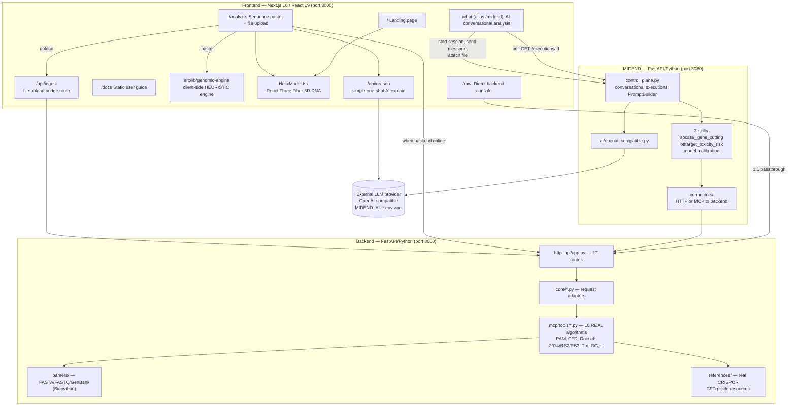
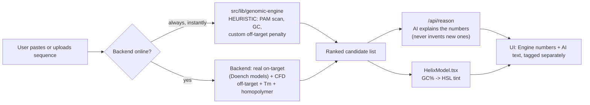
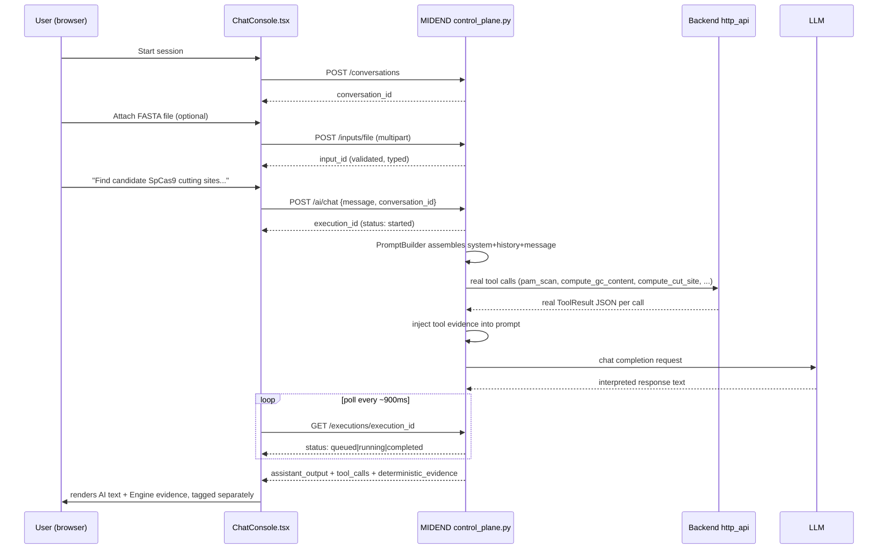
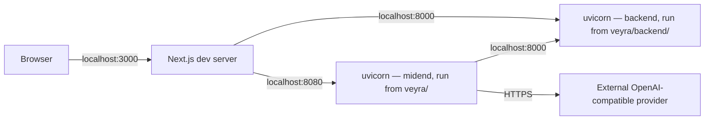

# VEYRA — Actual System Architecture

This supersedes `docs/architecture.md`, which describes only the earlier client-only version of VEYRA. Full detail and evidence: `docs/PROJECT_HANDOFF.md`.

## System overview

## Layer responsibilities (enforced structurally, not just by convention)

| Layer | Owns | Never does |
|---|---|---|
| Backend | Every deterministic number (PAM, GC, Tm, CFD, on-target models) | Talk to an LLM, know about conversations |
| MIDEND | Conversation/session state, tool orchestration, prompt construction | Compute any biology itself — confirmed by search, zero scoring math in `veyra/midend/` |
| Frontend | UI, session initiation, a fast client-only heuristic fallback | Persist data server-side (no database anywhere) |

## Data flow — `/analyze` (paste/upload path)

## Data flow — `/chat` (primary AI-orchestrated path)

## Deployment topology (current — hackathon/local only)

No reverse proxy, no container orchestration, no process supervisor. All three processes must be started manually and have repeatedly dropped between work sessions (an operational, not code, issue).
